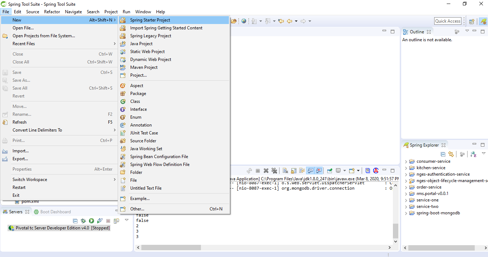
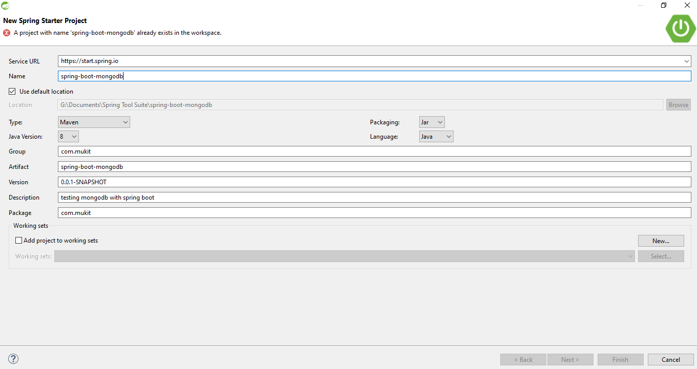
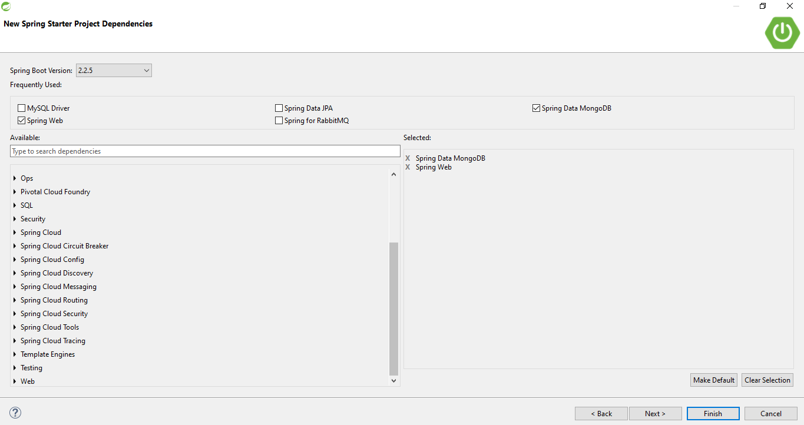
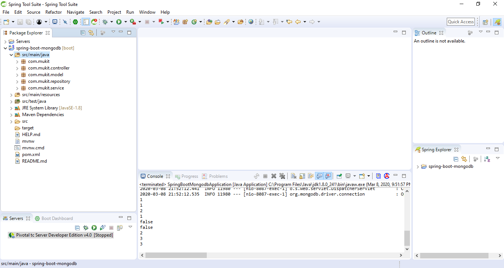
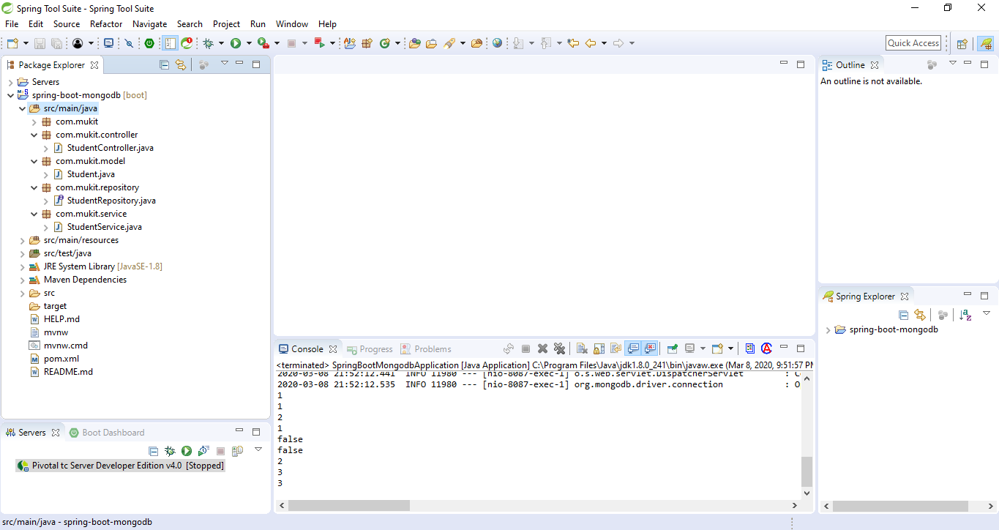

# Step by Step guide of building Spring Boot CRUD application with MongoDB

## Step 1:
Create a new project


## Step 2:
Fill all the fields like below image


## Step 3:
Choose `SpringWeb` and `Spring Data MongoDB` and click `Finish`


## Step 4:
Create 4 packages like below image inside `src/main/java`


## Step 5:
Create class and interface like below image inside created packages in above step



## Step 6:
Update `application.properties` file like this:
```
server.port=8087
 
spring.data.mongodb.host=localhost
spring.data.mongodb.port=27017
spring.data.mongodb.database=StudentDetail
```

## Source Code

### Model/Entity
```java
package com.mukit.model;

import org.springframework.data.annotation.Id;
import org.springframework.data.mongodb.core.mapping.Document;

@Document
public class Student {

	@Id
	private Long _id;
	private String name;
	private String dept;

	public Long getId() {
		return _id;
	}

	public void setId(Long id) {
		_id = id;
	}

	public String getName() {
		return name;
	}

	public void setName(String name) {
		this.name = name;
	}

	public String getDept() {
		return dept;
	}

	public void setDept(String dept) {
		this.dept = dept;
	}

	public Student() {

	}

	public Student(Long id, String name, String dept) {
		_id = id;
		this.name = name;
		this.dept = dept;
	}

	@Override
	public String toString() {
		return "Student [Id=" + _id + ", name=" + name + ", dept=" + dept + "]";
	}

}

```

### Repository
```java
package com.mukit.repository;

import org.springframework.data.mongodb.repository.MongoRepository;

import com.mukit.model.Student;

public interface StudentRepository extends MongoRepository<Student, Long> {

}
```

### Service
```java
package com.mukit.service;

import java.util.List;
import java.util.Optional;

import org.springframework.beans.factory.annotation.Autowired;
import org.springframework.stereotype.Service;

import com.mukit.model.Student;
import com.mukit.repository.StudentRepository;

@Service
public class StudentService {

	@Autowired
	StudentRepository studentRepository;

	public boolean createStudent(Student student) {
		try {
			studentRepository.save(student);
			return false;
		} catch (IllegalArgumentException e) {
			return false;
		}

	}

	public List<Student> findAll() {
		return studentRepository.findAll();
	}

	public Optional<Student> findById(Long id) {
		return studentRepository.findById(id);
	}

	public void updateStudent(Long id, Student student) {
		studentRepository.save(student);
	}

	public void deleteStudent(Long id) {
		studentRepository.deleteById(id);
	}

	public void deleteAllStudent() {
		studentRepository.deleteAll();
	}
}

```

### Controller
```java
package com.mukit.controller;

import java.util.List;
import java.util.Optional;

import org.springframework.beans.factory.annotation.Autowired;
import org.springframework.web.bind.annotation.DeleteMapping;
import org.springframework.web.bind.annotation.GetMapping;
import org.springframework.web.bind.annotation.PathVariable;
import org.springframework.web.bind.annotation.PostMapping;
import org.springframework.web.bind.annotation.PutMapping;
import org.springframework.web.bind.annotation.RequestBody;
import org.springframework.web.bind.annotation.RequestMapping;
import org.springframework.web.bind.annotation.RestController;

import com.mukit.model.Student;
import com.mukit.service.StudentService;

@RestController
@RequestMapping("students")
public class StudentController {
	@Autowired
	StudentService studentService;

	@PostMapping
	public void addStudent(@RequestBody Student student) {
		boolean result = studentService.createStudent(student);
		System.out.println(result);
	}

	@GetMapping
	public List<Student> findAll() {
		return studentService.findAll();
	}

	@GetMapping("/{id}")
	public Optional<Student> findById(@PathVariable("id") Long id) {
		System.out.println(id);
		return studentService.findById(id);
	}

	@PutMapping("/{id}")
	public void updateById(@PathVariable("id") Long id, @RequestBody Student student) {
		studentService.updateStudent(id, student);
	}

	@DeleteMapping("/{id}")
	public void deleteById(@PathVariable("id") Long id) {
		studentService.deleteStudent(id);
	}

	@DeleteMapping
	public void deleteAll() {
		studentService.deleteAllStudent();
	}
}

```